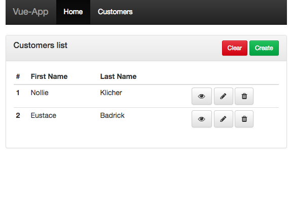

#LearnJS

LearnJS is a repository which gathers simple project build to discover and train myself with modern JavaScript libraries and frameworks.
Webapps offers regular features such as displaying a list, managing a form and connect with an API.

It includes :
* a router to make it an SPA
* form management for the customer form 
* module to manage ReST API calls

|Customers list| Customer form|
|--------------|--------------|
|||

##What's inside
It's all written using last ES6 features.  
Depending on the projects it includes a bundler, a linter and a local developement server.

* [**AngularJs-App**](angularjs-app)
* [**React-App**](react-app)
* [**Vue-App**](vue-app)

* [**MockApi**](mock-api) to experiment ReST API calls

##Run it
All webapps requires `mock-api` to be runned.  
They're all about npm projects, just use `npm run` command.
