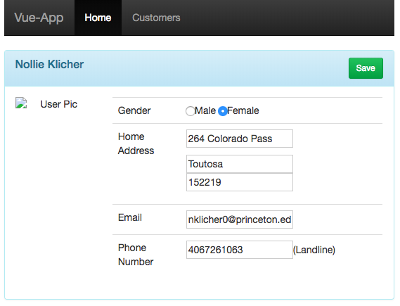

#AngularJS-App

AngularJS-App is a simple project build to discover and train yourself about AngularJS.
This webapp offers regular features such as displaying a list, managing a form and connect with an API.

It includes :
* a router to make it an SPA
* form management for the customer form 
* module to manage ReST API calls

|Customers list| Customer form|
|--------------|--------------|
|||

##Run it
**Requirement**: checkout `mock-api` project and run it.
```
npm start
```

##Technologies
###Framework
* [AngularJS 1.x](https://docs.angularjs.org/tutorial/step_00)
* [UI-Router for AngularJS](https://ui-router.github.io/ng1/tutorial/helloworld)
* [Angular Resource](https://docs.angularjs.org/api/ngResource/service/$resource)

###Build
* [Browserify](http://browserify.org/demos.html)
* [Gulp](https://github.com/gulpjs/gulp/blob/v3.9.1/docs/API.md)
* [Express JS](https://expressjs.com/en/starter/hello-world.html)

##Some links about AngularJS